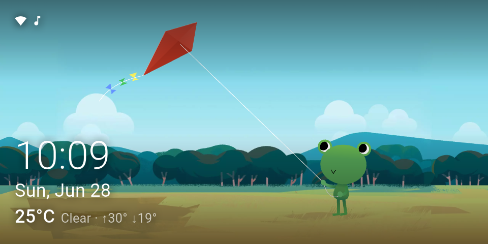
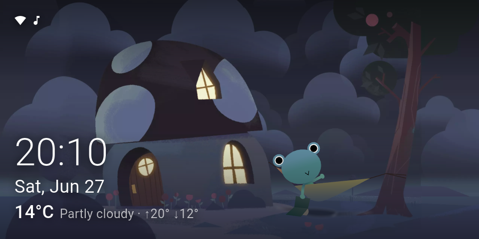
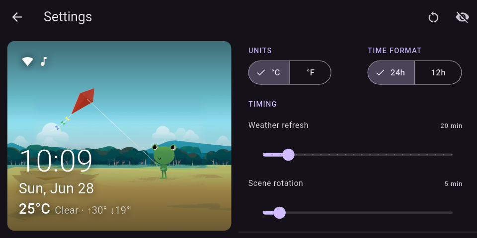
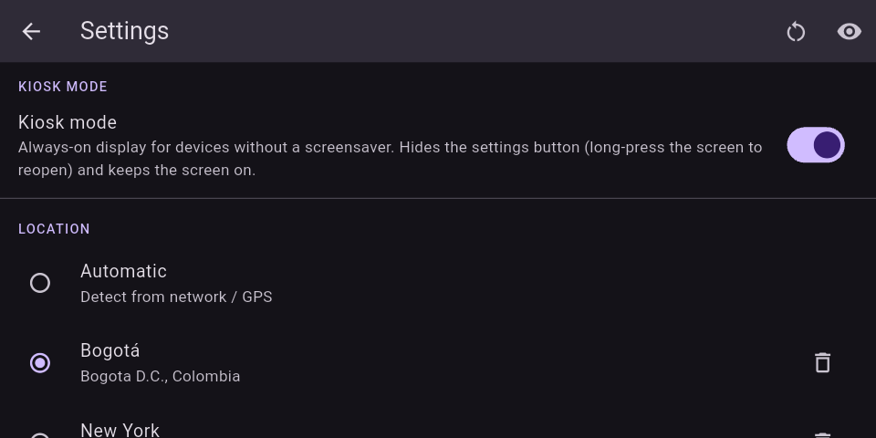

# Froggy

Froggy shows the Google Weather Frog animation and background that match the current weather and time of day wherever you are. 

Weather comes from [Open-Meteo](https://open-meteo.com/), so there is no API key or account to set up, and you can use your detected location or pick a saved city.

It runs as an Android screensaver, or full-screen with kiosk mode on devices that do not support one, such as an Echo Show. It
keeps showing the last forecast when offline and dims itself at night.

|  |  |
|:---:|:---:|
|  |  |
|  |  |

## Download

Get the latest APK from the [releases page](https://github.com/R0rt1z2/Froggy/releases/latest), or [download it directly](https://github.com/R0rt1z2/Froggy/releases/latest/download/froggy.apk).

## Set as screensaver

On phones, tablets and most Android devices, enable it from the system settings:
**Settings -> Display -> Screen saver** (sometimes under *Advanced*), set the screen saver to **Froggy**, then start it to preview.

On Android TV / Chromecast with Google TV the system settings only expose Google's own Ambient mode, so set the daydream over ADB instead:

```
adb connect <device-ip>:5555
adb shell settings put secure screensaver_enabled 1
adb shell settings put secure screensaver_components com.r0rt1z2.froggy/com.r0rt1z2.froggy.FroggyDreamService
adb shell settings put secure screensaver_activate_on_sleep 1
adb shell settings put secure screensaver_activate_on_dock 1
```

Start it right away (you may need to run it twice) with:

```
adb shell am start -n com.android.systemui/.Somnambulator
```

To go back to the stock screen saver, set `screensaver_components` to your device's default (on Google TV that is
`com.google.android.apps.tv.dreamx/com.google.android.apps.tv.dreamx.service.TvDreamService`).

On devices without a screen saver, use **kiosk mode** in the in-app settings instead.

## Build

```
flutter pub get
flutter run
```

## Notes

Assets are Google's, reused under fair use. Not affiliated with Google.
